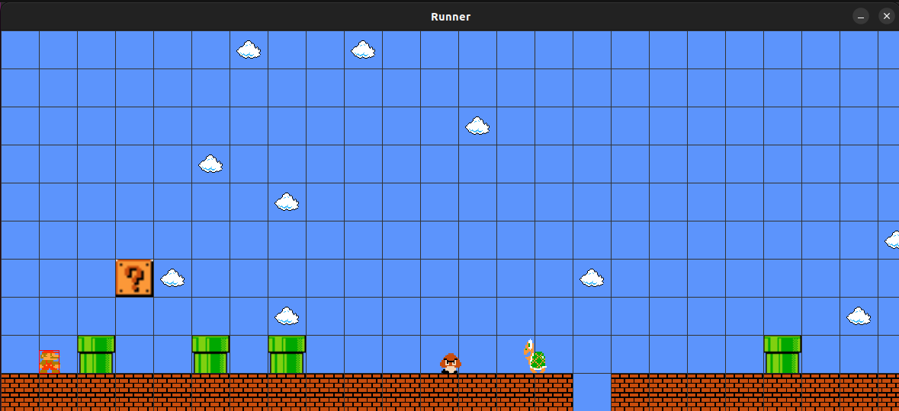

# Mario

## Description

    Brève description : Un jeu 2D inspiré de Mario avec un principe de génération procédurale, développé avec Java Swing.
    Gameplay : Le but est de rester le plus longtemps en vie

## Fonctionnalités

    - Niveaux :
        Il n'y a pas plusieurs niveaux mais un seul qui ne se termine théoriquement jamais.
    
    - Power-ups : 
        Fonctionnalité à venir.
    - Ennemies : 
        - Goomba : champigon de mario , un ennemie qui apparaît de façon aléatoire. 
        - Koopa : la tortue verte est l'ennemie qui avance le plus vite du jeu
        - Koopa Feu : (en cours de développement), cet ennemie peut lancer des boules de feux pour toucher et tuer son ennemie.
    - Map :
        - Celle-ci est générée aléatoirement tout en restant faisable pour le joueur.

## Prérequis

    Un launcher java

## Installation

     Un launcher java

## Utilisation

### Commandes pour jouer

Les flèches pour la direction et le saut.

- aller à gauche :  →
- aller à droite :  ←
- saut : ↑

### Lancement de projet

    - javac */*.java 
    - cd src
    - java main.Game

## Captures d'écran

## Développement

## Outils utilisés

Java, Swing, AWT , etc.

## Structure du projet

- assets : les images du jeux,
- src : le dossier contenant toute la logique du code
  - Character : regroupe tous les personnages du jeu
  - Inputs : pour la gestion des entrées clavier
  - Main : regroupe les composants essentiels de l'application dont celle de son lancement
  - Map : regroupe tous les éléments concernant la Map
  - Music
  - Utils : la gestion des collisions + le stockage des constantes de l'application

## Crédits

    Auteurs : Estelle Vicky, Roman Kiziltoprak et Gaëlle De Nas De Tourris.
    Ressources : Song Mario Original + Sprites originaux
